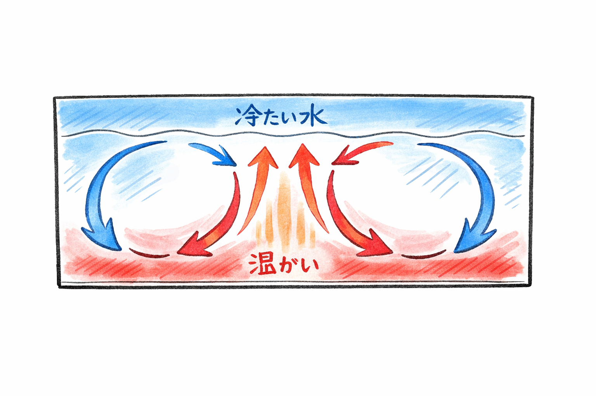
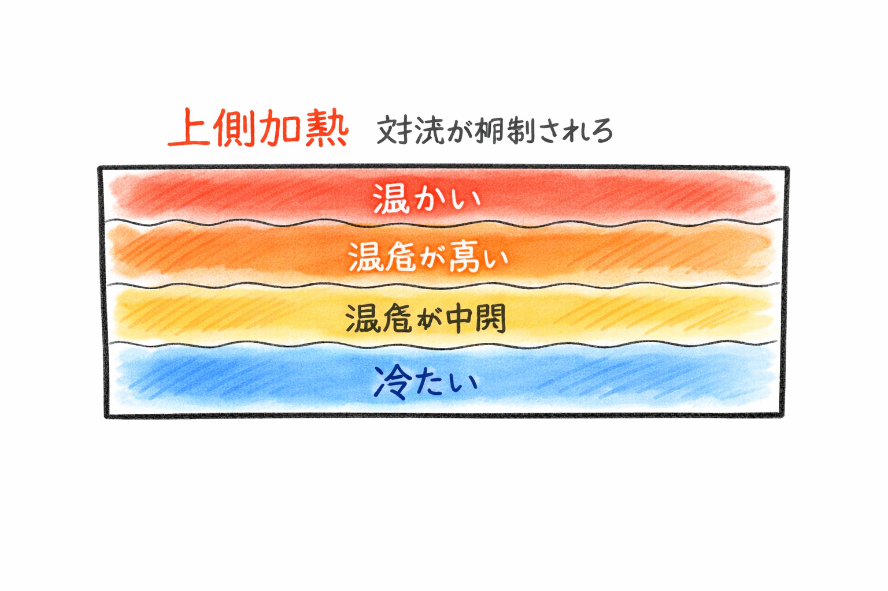
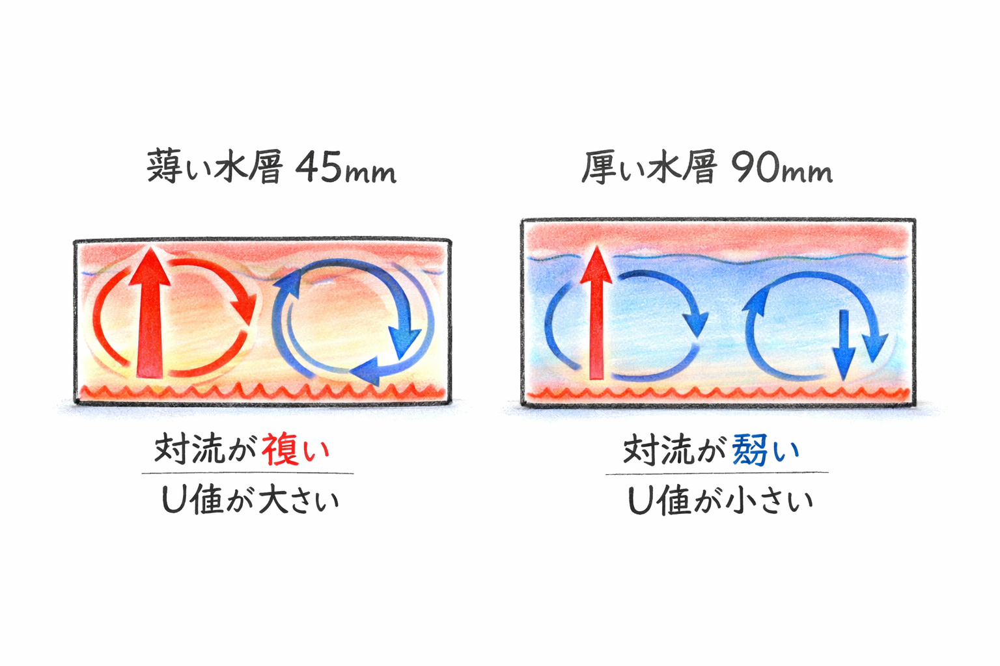

# heatbox_izena
# 🔥 保護熱箱シミュレーション（伊是名プロジェクト）

このリポジトリは、水を満たした「保護熱箱」の中で起こる  
**対流・伝導・熱貫流率（U値）の変化を直感的に理解できるシミュレーション** をまとめたものです。

- 下側加熱 → 対流が発生し、流れが循環する  
- 上側加熱 → 対流が抑制され、伝導が支配的になる  
- 水層の厚さによって U値がどう変わるか  
- 流線（ストリームライン）や等温線（アイソサーム）で可視化  

技術者だけでなく、初めて熱の世界に触れる方にも分かりやすい構成になっています。

---

## 📘 ノートブックを見る方法

GitHub はノートブックを正しく表示できないことがあります。  
そのため、以下の2つの方法を用意しています。

---

### 🔸 安定して閲覧できる（nbviewer）

GitHub がエラーになる場合でも、こちらなら確実に開けます。

---

### 🔹 インタラクティブ版（Google Colab）

ブラウザだけで動かせる体験版です。  
厚さ・温度差・係数をスライダーで動かしながら、  
対流や伝導の変化をリアルタイムで確認できます。

---

## 🧪 このシミュレーションでできること

- **下側加熱（対流 ON）**  
  - レイリー数（Ra）  
  - ヌッセルト数（Nu）  
  - 流線（ストリームライン）  
  - U値の変化  

- **上側加熱（対流 OFF）**  
  - 伝導支配の温度分布  
  - 等温線（アイソサーム）  

- **水層の厚さと U値の関係をグラフ化**

---

## 📦 リポジトリ内のファイル

| ファイル名 | 説明 |
|------------|------|
| `Untitled12new.ipynb` | GitHub 用の英語版ノートブック（安定表示用） |
| `README.md` | この説明書 |
| （任意）`colab_version.ipynb` | Colab 用のウィジェット付きインタラクティブ版 |

---

## 🔤 英語 ↔ 日本語 対照表（初心者向け）

| 英語 | 日本語 |
|------|--------|
| Heatbox | 保護熱箱 |
| Convection | 対流 |
| Conduction | 伝導 |
| Streamlines | 流線 |
| Isotherms | 等温線 |
| Thickness | 厚さ |
| Temperature difference | 温度差 |
| U-value | 熱貫流率 |
| Rayleigh number | レイリー数 |
| Nusselt number | ヌッセルト数 |

---

## 🙌 このプロジェクトについて

このシミュレーションは、  
**「熱の世界を、誰でも直感的に楽しめるように」**  
という思いから作られました。

- 技術者  
- 営業の方  
- 高齢者  
- 学生  
- 初めて Python に触れる方  

どなたでも楽しめるように工夫しています。

 
## 🖼️ 説明図（イメージ）
---

## 🖼 ① 下側加熱：対流セルができる

**説明：**  
下側から加熱すると、温かい水が上昇し、冷たい水が下降して大きな渦ができます。  
これが **自然対流** の基本です。
【補足の深川コメント】どうやらCopilotで挿し絵作成を日本語でお願いすると、
作図エンジンと文字編集エンジンとを統合できずに、図中の文字が中国簡易体に
文字化けするようです。「冷たい水」と「温かい（水）」が正解です。

---

## 🖼 ② 上側加熱：対流が抑制される

**説明：**  
上側が温かい場合、温かい水は上に留まり、冷たい水は下に沈むため、  
**対流がほとんど起きません。**  
温度は層状に分かれます。
【補足の深川コメント】図中の文字が中国簡易体になっています。
「上側加熱」対流が抑制される
上から、温かい、温度が高い、温度が中間、冷たい
が正解です。

---

## 🖼 ③ 水層厚さの違い（45mm vs 90mm）による対流の比較

**説明：**

- **45mm（薄い水層）**  
  温められた水がすぐに上昇し、冷たい水が下降して大きな渦ができます。  
  **対流が強く、熱がよく混ざり、U値が大きくなります。**

- **90mm（厚い水層）**  
  上昇した水が途中で冷やされやすく、渦が小さくゆっくりした流れになります。  
  **対流が弱く、熱の混ざりが悪く、U値は小さくなります。**

※ 初期の立ち上がりでは厚い水層の方が上昇速度が速く見えることがありますが、  
　定常状態では薄い水層の方が対流が強くなります。
 【補足の深川コメント】図中の文字が中国簡易体になっています。
上段のタイトル　→「薄い水槽45㎜」vs「厚い水槽90㎜」
図下の一行め　→「対流が強い」vs「対流が弱い」
図下の2行め　→「U値が大きい」vs「対流が弱い」　が正解です。

---

